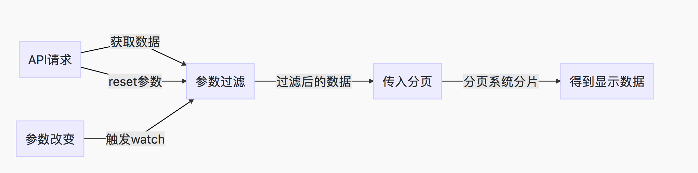

# 日常开发小经验

## Vue 实现前端分页注意事项
### 前提
分页是常用的页面展示数据，
当数据量不是特别大的时候，
我们可以选择灵活量比较大的前端分页。
但是，分页需要面对的参数比较多，
如果处理不好的话，很容易造成页面的可读性差。

### 项目环境
Vue + iview

### 思路


### 处理方式
#### 1、对应Pug
```
Card
    Row
        Input(v-model="params.key_1" placeholder="搜索 xxxx")
        ...
    Row
      Table(:columns="tableStyle" :data="ShowInfoList")
    Row
      Page(:total="SumNum",  :page-size="PageSize", @on-change="handlePage", show-elevator, show-total, show-sizer, :current='PageNum', @on-page-size-change="handlePageSize")
```
#### 2、首先变量
``` 
    data() {
        return {
            # 分页的相关参数
            SumNum: 0,
            PageNum: 1,
            PageSize: 10,
            # 获取的全部信息，参数过滤后的信息，最终展示的信息
            AllInfoList: [],
            FilterInfoList: [],
            ShowInfoList: [],
            # 需要过滤的参数
            params: {
                key_1: '',
                key_2: '',
                key_3: '',
            },
            tableStyle: {}
        }
    },
    
```
#### 3、methods 需要设计的方法
```
methods: {
    # 根据参数对所需要的信息进行过滤
    paramUpdate(val) {
            let temp = []
            # 对AllInfoList进行过滤
            for (let item of this.AllInfoList) {
                if (item.key_1.indexOf(val.key_1) === -1) {
                  continue
                }
                temp.push(item)
                # 根据 params 进行分发过滤 ...
            }
            # 调用一下分页,将页面设置为1.
            this.FilterInfoList = temp
            this.SumNum = temp.length
            this.handlePage(1)
    }
    # 页面改变函数
    handlePage (value) {
      this.PageNum = value
      this.ShowInfoList = this.FilterInfoList.slice(value * this.PageSize - this.PageSize, value * this.PageSize)
    },
    # pageSize变更函数
    handlePageSize (value) {
      this.pageSize = value
      this.pageNume = 1
      this.ShowInfoList = this.FilterInfoList.slice(0, this.PageSize)
    },
    # 信息获取函数
    getInfo() {
        const self = this
        API.xxx.get().then((res) => {
            # 置空 AllInfoList
            self.AllInfoList = [],
            # 对 params进行初始化(看需要)
            self.params = ....
            self.AllInfoList = res.data.xxxxx
            ...
            
            self.paramUpdate(self.params)
        })
    }
}
```
#### 4、需要做watch的操作
```
# 监听 params的变化
    watch: {
        params(val) {
            this.paramUpdate(val)
        }
    }
```
